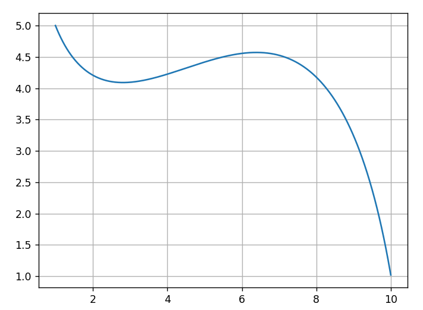

# Devan Yu

*Table of Contents:*
- [Introduction](#introduction)
- [Programming Skills](#programming-experience)
- [Short-Term Programming Goals](#short-term-programming-goals)
- [Hobbies](#hobbies)
- [Conclusion](#conclusion)

### Introduction
My name is Devan Yu, and I'm a junior undergraduate computer science major at UCSD. I like to think of myself as a hard worker and a quick learner, and I always strive to better myself in those aspects. I generally enjoy learning new things.

I'm Chinese American; both my parents were born in China, but I was born in the U.S. I can speak and understand Mandarin pretty fluently, but my reading and writing skills are lacking. A fun fact about me is that I'm a U.S. and Canada dual citizen, since my parents lived in Canada for awhile and were Canadian citizens when I was born. My hobbies include playing video games, watching basketball, watching badminton, and playing ping pong.

### Programming Experience
I would consider myself relatively inexperienced overall. The languages I have spent the most time using are **Java** and **C++**. I have recently started to learn **Python** as well. I wrote a small program in Python that draws [Bezier Curves](https://en.wikipedia.org/wiki/B%C3%A9zier_curve) to learn the language.

Here's an example of a Bezier Curve my program drew that used the points `(1, 5), (3, 2), (8, 8), (10, 1)`:

### Short-Term Programming Goals
- [ ] Get better at Python
- [ ] Refresh my Java
- [ ] Learn Rust (by building an NES emulator using [this tutorial](https://bugzmanov.github.io/nes_ebook/))
- [x] Procrastinate on all of these goals

### Hobbies
I really enjoy playing video games. Some of my favorite game series are:
- Xenoblade Chronicles
- Super Smash Bros.
- Persona

I also like to watch NBA basketball. I'm mostly a Golden State Warriors fan, but my current top three favorite teams to watch besides the Warriors are:
1. San Antonio Spurs
2. Los Angeles Clippers
3. New York Knicks

### Conclusion
> "Honestly, I didn't really know what I was doing..." - ~~Victor Wembanyama~~ Me after every program I write

This is mostly a joke, but it also has some truth to it. Going into most things I've done in computer science so far, I feel as though I've had little to no experience with whatever I'm working on compared to my peers. However, I view this as a good indication that whatever I'm doing is worth doing because I am learning. Whatever CSE 110 has in store for me, I know that I will learn a lot.
